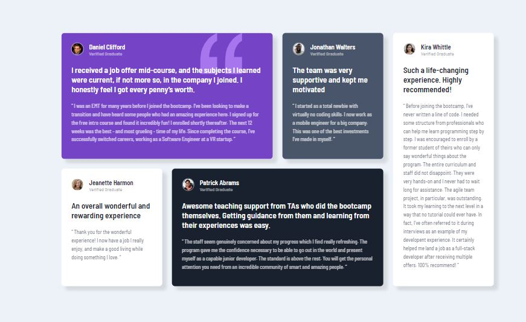

# Frontend Mentor - Testimonials grid section solution

This is a solution to the [Testimonials grid section challenge on Frontend Mentor](https://www.frontendmentor.io/challenges/testimonials-grid-section-Nnw6J7Un7). Frontend Mentor challenges help you improve your coding skills by building realistic projects. 

## Table of contents

- [Overview](#overview)
  - [The challenge](#the-challenge)
  - [Screenshot](#screenshot)
  - [Links](#links)
- [My process](#my-process)
  - [Built with](#built-with)
  - [What I learned](#what-i-learned)
  - [Continued development](#continued-development)
  - [Useful resources](#useful-resources)
- [Author](#author)


**Note: Delete this note and update the table of contents based on what sections you keep.**

## Overview

### The challenge

Users should be able to:

- View the optimal layout for the site depending on their device's screen size

### Screenshot

Mobile


Desktop



### Links

- Solution URL: [Add solution URL here](https://github.com/W3byMJL/TestimonialGrid)
- Live Site URL: [Add live site URL here](https://w3bymjl.github.io/TestimonialGrid/)

## My process

### Built with

- HTML
- CSS 
- CSS Grid
- Mobile-first workflow using Media Queries


### What I learned

I sought to use broader categories that I could apply to each content section instead of duplicating code and possibly forgetting to update it in that section as well. 

I was really hoping that my grid layout would be a bit more responsive, but I ended up using media query to switch the grid area from a vertical layout, to the grid layout.

```css
.grid-container {
    
    grid-template-areas:
    "content1"
    "content2"
    "content3"
    "content4"
    "content5";
}

  .grid-container {
       grid-template-areas: 
        "content1 content1 content2 content5"
        "content3 content4 content4 content5";
        
    }

```

### Continued development

I understand the concept with the container and the "sections" however I still don't know all that I could with grid. Plus when to choose pixels, fractions, ems, rems or % to size things is something I'm currently exploring.


### Useful resources

- [Example resource 1](https://www.w3schools.com/css/css_grid.asp) - I usually start with W3 Schools for a tutorial, and this got me going.
- [Example resource 2](https://www.youtube.com/watch?v=68O6eOGAGqA) - This video was the key to this challenge for me. 


## Author

- Frontend Mentor - [@yourusername](https://www.frontendmentor.io/profile/W3byMJL)


